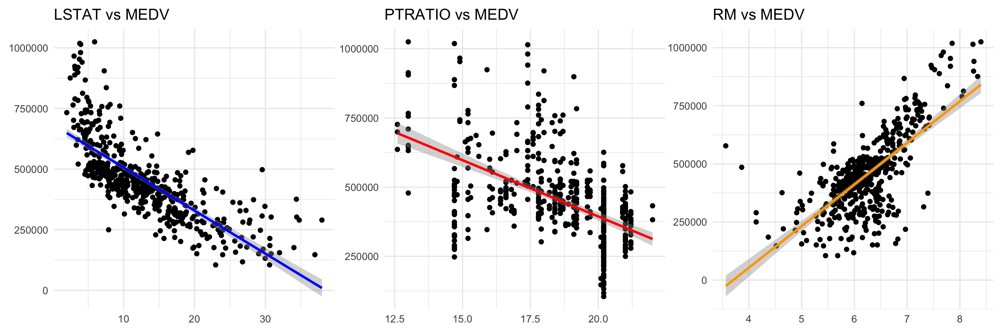

```{r setup, include=FALSE}
knitr::opts_chunk$set(echo = TRUE)
```

# Introduction

I am analyzing a simplified version of the Boston Housing dataset, downloaded from [Kaggle](https://www.kaggle.com/datasets/schirmerchad/bostonhoustingmlnd). The three features in this dataset are:

- RM: Average number of rooms per dwelling
- LSTAT: Percent lower status of the population
- PTRATIO: Pupil-teacher ratio by town

The target variable is MEDV, the median value of owner-occupied homes. My goal is to use linear regression and random forests to see how well these features predict home value. There are other datasets available online containing more features, but I will only be using the three listed here. 

Note: The features in this dataset, LSTAT, RM, PTRATIO, were recorded as part of a 1970 census-based analysis. Therefore, there is a lack of modern relevance. This dataset is used for purely technical exploration. 

# Exploratory Data Analysis

## Descriptive Statistics

```{r message=FALSE}
library(dplyr)
library(ggplot2)
library(tidyr)
library(patchwork)
library(kableExtra)
library(randomForest)

create_table = function(df) {
  kable(df, "html", align="c") %>%
    kable_styling(bootstrap_options = "striped")
}
```

```{r}
raw_df <- read.csv("housing.csv")

create_table(head(raw_df))
create_table(tail(raw_df))

create_table(summary(raw_df))
```

The median home value, $438,000, showcases another limitation of this dataset. When this data was originally recorded in 1970, median home value was capped at \$50,000. People have attempted to scale these values for inflation, even by reverse engineering the values to attempt to get the "true" value. However, current estimates of median home value in Boston, MA, from Realtor.com and Zillow, estimate the median to be around \$900,000. 

This dataset was last updated approximately 8 years. Therefore, at best the median home values were scaled for inflation up to 2017. Accounting for that, the median home price would go up to $579,000, still far off the real-world value. 

## Visualizations

I will calculate skew for each feature and the target variable in addition to plotting their distributions. 

```{r}
skewness = function(data, column) {
  col_data = as.numeric(data[[column]])
  n = length(col_data)
  mean = mean(col_data)
  std = sd(col_data)
  skew = (n*sum((col_data-mean)^3)) / ((n-1)*(n-2)*std^3)
  return(skew)
}
```

```{r}
p1 <- ggplot(data=raw_df, aes(x=RM)) +
  geom_density(color="steelblue", fill = "steelblue") +
  scale_x_continuous(limits=c(3, 9)) +
  scale_y_continuous(limits=c(0, 1), expand = c(0, 0)) +
  labs(title=paste("RM, skewness =", round(skewness(raw_df, "RM"), 2))) +
  theme_minimal() +
  theme(plot.title = element_text(hjust = 0.5))

p2 <- ggplot(data=raw_df, aes(x=LSTAT)) +
  geom_density(color="steelblue", fill = "steelblue") +
  scale_x_continuous(limits=c(-5, 45)) + 
  scale_y_continuous(limits=c(0, 0.07), expand = c(0, 0)) +
  labs(title=paste("LSTAT, skewness =", round(skewness(raw_df, "LSTAT"), 2))) +
  theme_minimal() +
  theme(plot.title = element_text(hjust = 0.5))

p3 <- ggplot(data=raw_df, aes(x=PTRATIO)) +
  geom_density(color="steelblue", fill = "steelblue") +
  scale_x_continuous(limits = c(10, 25)) +
  labs(title=paste("PTRATIO, skewness =", round(skewness(raw_df, "PTRATIO"), 2))) +
  theme_minimal() +
  theme(plot.title = element_text(hjust = 0.5))

p4 <- ggplot(data=raw_df, aes(x=MEDV)) +
  geom_histogram(bins = 30, color="black", fill="steelblue", linewidth=0.2) +
  labs(title=paste("MEDV, skewness =", round(skewness(raw_df, "MEDV"), 2))) +
  theme_minimal() +
  theme(plot.title = element_text(hjust = 0.5))

(p1 | p2) / (p3 | p4)
```

As I am utilizing linear regression later on, LSTAT's moderate right skewness indicates that a log transformation or square root can be beneficial. 


```{r results=FALSE}
# p5 <- ggplot(data=raw_df, aes(x=LSTAT, y=MEDV)) +
#   geom_point() +
#   geom_smooth(method = "lm", color = "blue") +
#   labs(title="LSTAT vs MEDV") +
#   theme_minimal() +
#   theme(plot.margin = margin(t = 2, r = 2, b = 2, l = 2), axis.title = element_blank())
# 
# p6 <- ggplot(data=raw_df, aes(x=PTRATIO, y=MEDV)) +
#   geom_point() +
#   geom_smooth(method = "lm", color = "red") +
#   labs(title="PTRATIO vs MEDV") +
#   theme_minimal() +
#   theme(plot.margin = margin(t = 2, r = 2, b = 2, l = 2), axis.title = element_blank())
# 
# p7 <- ggplot(data=raw_df, aes(x=RM, y=MEDV)) +
#   geom_point() +
#   geom_smooth(method="lm", color="orange") +
#   labs(title="RM vs MEDV") +
#   theme_minimal() +
#   theme(plot.margin = margin(0,0,0,0), axis.title = element_blank())
# 
# combined_plot <- p5 + p6 + p7 + plot_layout(nrow = 1)

#ggsave("plots_row.png", combined_plot, width = 12, height = 4, dpi = 300)

```



As expected, the higher proportion of people considered "lower class" in a given area and the higher student-teacher ratio appear to be negatively correlated with median house value. The average number of rooms in a dwelling appears to be positively correlated with median house value, also to be expected.  

# Data Preprocessing

## Outlier Detection and Removal

```{r}
remove_outliers <- function(data, columns = c("LSTAT", "RM", "PTRATIO")) {
  if (is.null(columns)) {
    columns <- names(data)[sapply(data, is.numeric)]
  }
  
  clean_data <- data
  outlier_info <- list()
  
  for (col in columns) {
    if (!col %in% names(data)) {
      warning(paste("Column", col, "not found in data frame"))
      next
    }
    
    if (!is.numeric(data[[col]])) {
      warning(paste("Column", col, "is not numeric, skipping"))
      next
    }
    
    Q1 <- quantile(data[[col]], 0.25, na.rm = TRUE)
    Q3 <- quantile(data[[col]], 0.75, na.rm = TRUE)
    IQR <- Q3 - Q1
    
    lower_bound <- Q1 - 1.5 * IQR
    upper_bound <- Q3 + 1.5 * IQR
    
    outliers <- which(data[[col]] < lower_bound | data[[col]] > upper_bound)
    
    outlier_info[[col]] <- list(
      count = length(outliers),
      indices = outliers,
      values = data[[col]][outliers],
      lower_bound = lower_bound,
      upper_bound = upper_bound
    )
    
    clean_data <- clean_data[is.na(data[[col]]) | 
                               (data[[col]] >= lower_bound & data[[col]] <= upper_bound), ]
  }
  
  cat("Outlier Removal Summary:\n")
  cat("Original data shape:", nrow(data), "rows,", ncol(data), "columns\n")
  cat("Clean data shape:", nrow(clean_data), "rows,", ncol(clean_data), "columns\n")
  cat("Total rows removed:", nrow(data) - nrow(clean_data), "\n\n")
  
  for (col in names(outlier_info)) {
    info <- outlier_info[[col]]
    cat("Column", col, ":\n")
    cat("  Outliers found:", info$count, "\n")
    cat("  Bounds: [", round(info$lower_bound, 3), ",", round(info$upper_bound, 3), "]\n")
    if (info$count > 0) {
      cat("  Outlier range: [", round(min(info$values), 3), ",", round(max(info$values), 3), "]\n")
    }
    cat("\n")
  }
  
  attr(clean_data, "outlier_info") <- outlier_info
  return(clean_data)
}

df = remove_outliers(raw_df)
```

## Train and Test Sets

```{r}
set.seed(123)
train_indices <- sample(1:nrow(df), size = 0.8*nrow(df))

train_data = df[train_indices, ]
test_data = df[-train_indices, ]

X_train <- train_data[, !names(train_data) %in% "MEDV"]
y_train <- train_data$MEDV
X_test <- test_data[, !names(test_data) %in% "MEDV"]
y_test <- test_data$MEDV
```

# Comparing Different Models

## Linear Regression

Previously, I noted LSTAT's skewness. I will evaluate linear regression's performance with and without a log transformation of LSTAT.

### Baseline Linear Regression

```{r}
lm <- lm(y_train ~ ., data=X_train)
summary(lm)

train_predictions <- predict(lm, X_train)
test_predictions <- predict(lm, X_test)

train_r2 <- summary(lm)$r.squared
test_r2 <- cor(test_predictions, y_test, use = "complete.obs")^2

ggplot(mapping = aes(x = lm$fitted.values, y = lm$residuals)) + 
  geom_point(shape = 1) +
  geom_smooth(method = "loess", se = FALSE, color = "blue") + 
  geom_hline(yintercept = 0, linetype = "dashed", color = "red") +
  labs(
    x = "Fitted Values",
    y = "Residuals",
    title = "Residuals vs Fitted"
  ) +
  theme_minimal() +
  theme(plot.title = element_text(hjust = 0.5))

cat("Train R^2:", train_r2, "\n")
cat("Test R^2:", test_r2)
```

For baseline linear regression, we have both an $R^2$ and adjusted $R^2$ value of 0.72 for the training set and an $R^2$ of 0.73 for the test set. For the training set, both of these values being nearly identical suggest that the model is not overfitting and that adding other predictors, which are available in other similar datasets online, would not drastically improve model performance. A similar $R^2$ for the test set shows that this model generalizes relatively well wtihout overfitting.

As you can see in the residuals vs. fitted graph, though, the model is underestimating median home value at the lower and tail ends, suggesting a non-linear relationship and that other factors are at play which aren't accounted for in the model. Next I will try a log transformation on LSTAT to see if the underestimation in these areas are improved. 

### Linear Regression with Log Transformation

```{r}
lm_log <- lm(y_train ~ RM + PTRATIO + log(LSTAT), data=X_train)
summary(lm_log)

train_predictions_log <- predict(lm_log, X_train)
test_predictions_log <- predict(lm_log, X_test)

train_r2_log <- summary(lm_log)$r.squared
test_r2_log <- cor(test_predictions_log, y_test, use = "complete.obs")^2

ggplot(mapping = aes(x = lm_log$fitted.values, y = lm_log$residuals)) + 
  geom_point(shape = 1) +
  geom_smooth(method = "loess", se = FALSE, color = "blue") + 
  geom_hline(yintercept = 0, linetype = "dashed", color = "red") +
  labs(
    x = "Fitted Values",
    y = "Residuals",
    title = "Residuals vs Fitted"
  ) +
  theme_minimal() +
  theme(plot.title = element_text(hjust = 0.5))

cat("Train R^2:", train_r2_log, "\n")
cat("Test R^2:", test_r2_log)
```

A log transformation of LSTAT slightly improved the model fit on training data ($R^2$ from 0.717 to 0.743) and reduced the residual standard error. However, test $R^2$ dipped to 0.719, leaving a 2.4% gap between train and test $R^2$. So better training accuracy and better residual behavior comes at the cost of less generalization. 

Additionally, although the effect is less dramatic after the log transformation, the model still underestimates median home value quite significantly with homes valued at more than ~$650,000. This is likely due to factors not accounted for in this dataset like location and luxury details that become more significant at higher prices.

A similar problem happens at the low end as well, but the log transformation minimizes the underestimation. 

Because of the slight problem with overfitting, the baseline linear regression model is likely the superior model. 

## Random Forest

```{r}
train_df <- cbind(X_train, MEDV = y_train)
rf_model <- randomForest(MEDV ~ ., data = train_df, ntree = 20, mtry = 1, nodesize = 40, importance = TRUE, na.action = na.exclude)
print(rf_model)
```

```{r}
train_preds <- predict(rf_model, X_train)
test_preds <- predict(rf_model, X_test)

train_r2 <- cor(train_preds, y_train, use = "complete.obs")^2
test_r2 <- cor(test_preds, y_test, use = "complete.obs")^2

cat("Train R^2:", train_r2, "\n")
cat("Test R^2:", test_r2)

```

Using a random forest, we get a train $R^2$ of 0.85 and a test $R^2$ of 0.82. Random forests tend to perform better when there are more features to work from, as using one with my dataset with only three features has shown that it has a larger problem with overfitting than linear regression. 

```{r warning=FALSE}
ggplot(data.frame(Predicted = test_preds, Actual = y_test), aes(x = Actual, y = Predicted)) +
  geom_point(shape = 1, alpha = 0.6) +
  geom_abline(slope = 1, intercept = 0, color = "blue", linetype = "dashed") +
  theme_minimal() +
  labs(title = "Random Forest: Predicted vs Actual (Test Set)",
       x = "Actual MEDV", y = "Predicted MEDV") +
  theme(plot.title = element_text(hjust = 0.5))
```

```{r}
importance_df <- as.data.frame(importance(rf_model))
importance_df$Variable <- rownames(importance_df)

ggplot(importance_df, aes(x = reorder(Variable, `%IncMSE`), y = `%IncMSE`)) +
  geom_bar(stat = "identity", fill = "steelblue") +
  coord_flip() +
  theme_minimal() +
  labs(
    title = "Variable Importance (%IncMSE)",
    x = "Variable",
    y = "% Increase in MSE"
  ) +
  theme(plot.title = element_text(hjust = 0.5))
```

# Final Performance Comparison

```{r}
lm_train_r2 <- 0.7174
lm_test_r2 <- 0.7262
lm_adj_r2 <- 0.715

lm_log_train_r2 <- 0.7433
lm_log_test_r2 <- 0.719
lm_log_adj_r2 <- 0.7411

rf_train_r2 <- 0.8541
rf_test_r2 <- 0.8201

results_df <- data.frame(
  Model = c("Linear Regression", "Linear Regression (log LSTAT)", "Random Forest"),
  `Train R2` = c(lm_train_r2, lm_log_train_r2, rf_train_r2),
  `Test R2` = c(lm_test_r2, lm_log_test_r2, rf_test_r2),
  `Adjusted R2` = c(lm_adj_r2, lm_log_adj_r2, NA)
)

results_df %>%
  kable("html", digits = 3, caption = "Model Performance Comparison") %>%
  kable_styling(bootstrap_options = c("striped", "hover", "condensed", "responsive"), 
                full_width = FALSE, 
                position = "center") %>%
  row_spec(0, bold = TRUE)
```

Overall, baseline linear regression is likely the best model, even with random forest's higher accuracy. Linear regression is more stable and generalizes very well to unseen data. 